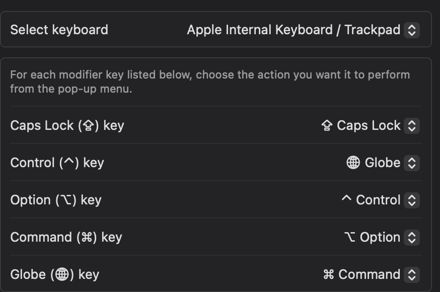
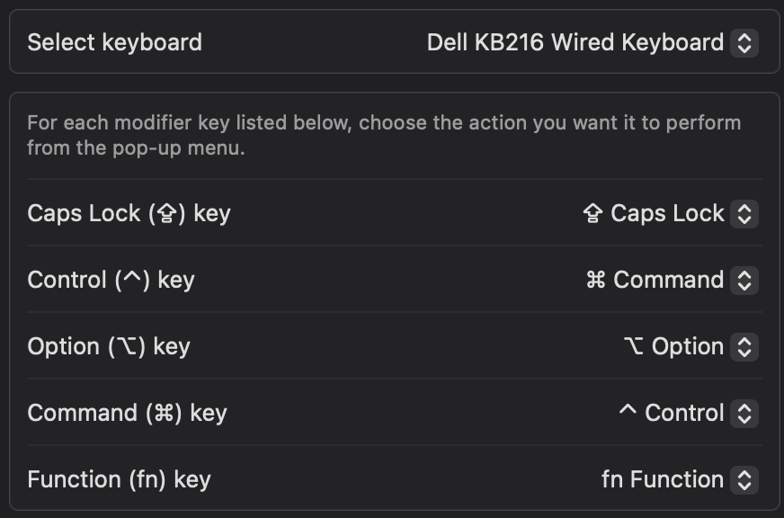

# Hammerspoon Configuration

This repository contains a personal Hammerspoon configuration for macOS automation.

The main goals are:

1. Provide a keyboard & shortcut experience which is closer to Linux(/Windows) ones.
2. Provide dedicated quick app-switching functionality. I first started doing this on Windows with AutoHotkey, then on KDE Linux with KWin scripts.

Of all the tools available (see the keyboard flow [docs](docs/macos-keyboard-input-handling.md))
I am trying to stick
 to
 * hidutil (low-level key remapping, eg modifiers and F-keys)
 * custom keyboard layout (for accents, compose key)
 * Hammerspoon (for most shortcuts and automation)
 
 Notably I am skipping Karabiner as it is heavy and can have compatibility issues ([Karabiner-Elements#3708](https://github.com/pqrs-org/Karabiner-Elements/issues/3708)) (although light modifications like [hyper key](https://dev.to/ccedacero/better-shortcuts-with-karabiner-elements-and-hammerspoon-1plf) seem to not cause issues).

## Dependencies

### Apps

*ConfigConsole.lua* sets the font to Fira Code, so:

```sh
brew install font-fira-code
```

### Settings
To make the experience closer to Linux, I am remapping the keys in the main MacOS hardware keyboard (in *Settings > Keyboard > Keyboard Shortcuts > Modifier keys*) as follows:

```
Before:   🌐  ^  ⌥  ⌘   (Fn     Control Option  Command)
After :   ⌘  🌐  ^  ⌥   (Command   Fn   Control  Option)
```



On typical external Windows keyboards, it is simpler as only Command (Windows logo) and Control need to be swapped. When using Keychron keyboard which have a MacOS mode, I leave them in Windows mode.

```
Before:   ^   ⊞ = ⌘   ⌥    (Control ; Windows == Command ; Alt == Option)
After :   ⌘     ^     ⌥    (Command      Control  Option)
```



(Note that this remapping has to be done for each external keyboard you connect, unless you use a separate tool like Karabiner-Elements)


## Hotkeys

The following table lists all the configured hotkeys and their actions.
A more up-to-date list can be found with `Ctrl+/`.

| Hotkey             | Action                                                              |
| ------------------ | ------------------------------------------------------------------- |
| `Ctrl + R`         | Reload Hammerspoon configuration                                    |
| `F10`              | Toggle mute in Microsoft Teams (only during an active meeting)      |
| `F11`              | Volume Down                                                         |
| `F12`              | Volume Up                                                           |
| `F5`               | Refresh (sends `Cmd + R`)                                           |
| `Ctrl + E`         | Focus/Launch Finder                                                 |
| `Ctrl + Z`         | Focus/Launch Terminal                                               |
| `Ctrl + S`         | Focus/Launch System Settings                                        |
| `Ctrl + F`         | Focus/Launch Firefox                                                |
| `Ctrl + G`         | Focus/Launch Google Chrome                                          |
| `Ctrl + H`         | Focus/Launch Safari                                                 |
| `Ctrl + A`         | Focus/Launch Anytype                                                |
| `Ctrl + N`         | Focus/Launch Lapce                                                  |
| `Ctrl + V`         | Focus/Launch Visual Studio Code                                     |
| `Ctrl + X`         | Focus/Launch Windsurf                                               |
| `Ctrl + T`         | Focus/Launch Microsoft Teams                                        |
| `Ctrl + W`         | Focus/Launch Microsoft Word                                         |
| `Ctrl + P`         | Focus/Launch Microsoft Powerpoint                                   |
| `Ctrl + Q`         | Focus/Launch Microsoft 365 Copilot                                  |
| `Ctrl + I`         | Focus/Launch PaintZ                                                 |
| `Ctrl + C`         | Focus/Launch Microsoft Outlook and switch to Calendar view          |
| `Ctrl + M`         | Focus/Launch Microsoft Outlook and switch to Mail view              |

## Key Remappings

Swapping Command and Control is the easiest solutions since it covers the many app-specific hotkeys, but it is a bit too extreme, so some things need to be "swapped back" with those remappings:

This configuration also includes the following key remappings to provide a more consistent experience:

- `Cmd + Tab` is remapped to `Ctrl + Tab` for application switching together with `Cmd + Shift + Tab`.
- `Cmd + Left/Right Arrow` behavior is swapped with `Option + Left/Right Arrow` for text navigation.
- `Cmd + Delete` behavior is swapped with `Option + Delete`.

## Bugs

* The focus cycle-through only works between the 2 most recent windows (probably because the stack gets reordered) -> fix it with the AppWindowSwitcher.spoon ? (committed but not used yet...)

* The system-wide F10 hotkey for Teams Mute has an issue where it sends the hotkey to first Teams window it finds. If that's a Chat window and not the Meeting window, the hotkey will be ignored.

* The F11 key remap does not work for some reason. Use the `hidutil` aproach ?


## Future Improvements

> Hammerspoon can use hs.eventtap to swap only when frontmost app is not in an exclusion list. This is less robust than Karabiner for low-level modifier timing: there are edge cases with chord timing and held modifiers while Karabiner handles this more reliably.

* Fix terminal as it is using Ctrl for special characters, conflicting with my app focus hotkeys.
* Use of spoons

* Audio priority
From [init.lua](https://github.com/dguo/dotfiles/blob/main/programs/hammerspoon/init.lua)


## Awesome scripts for inspiration

* [muescha/dot_hammerspoon: Hammerspoon scripts](https://github.com/muescha/dot_hammerspoon)
  * Functions
    * MenuBarChooser - Select an icon in the macOS menu bar. Also find hidden icons.
    * ChromeTabCopyLink - With this it is fast to copy the current title and link as markdown text.
    * ChromeTabToNewWindow
  * Spoons
    * HotKeySheet.spoon - replacement for hs.hotkey.showHotkeys
  * Helpers
    * ErrorCatcher 
    * **BindHotkey only to some apps** - If you like to have hotkeys only in some apps or exclude some apps from your global hotkeys, then the helper bindHotkey help you.

* [zzamboni.org | My Hammerspoon Configuration, With Commentary](https://zzamboni.org/post/my-hammerspoon-configuration-with-commentary/)
  * URL dispatching to site-specific browsers
  * various Window placement
  * ToggleScreenRotation 
  * many more...


 
## Related

[TIL/0000-MacOS.md at main · eddy-geek/TIL](https://github.com/eddy-geek/TIL/blob/main/0000-MacOS.md)

[List of Mac/Apple keyboard symbols](https://gist.github.com/jlyonsmith/6992156f18c423fd1c5af068aa311fb5)