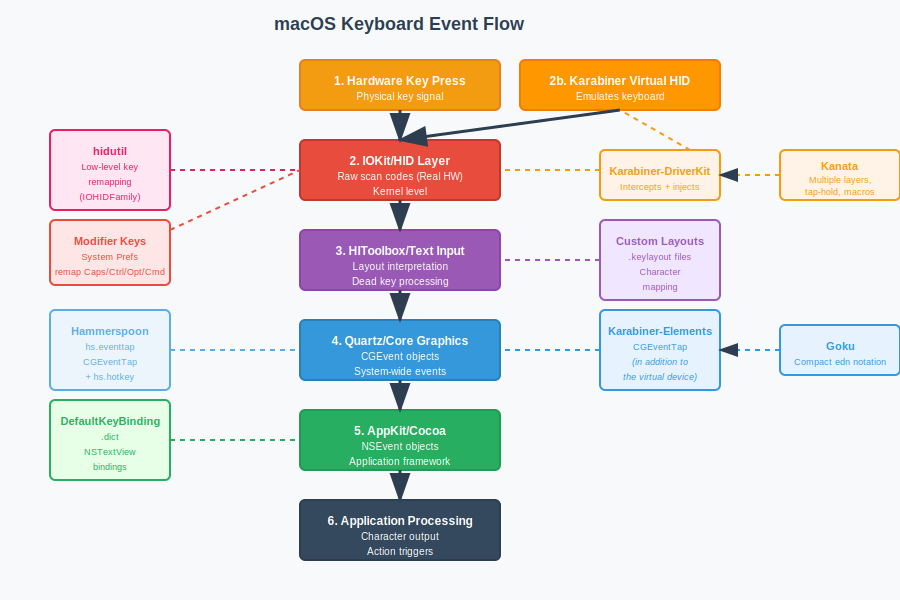

# macOS Keyboard Event Flow

*Warning: AI-generated*

Here's the keyboard event flow on macOS:

## 1. Hardware Key Press

* The initial physical action when you press a key sends a signal to the computer.

## 2. IOKit/HID (Hardware Interface Device) Layer

* **Layer:** Lowest level of macOS input stack, residing in the kernel.
* **Function:** IOKit's HID subsystem communicates directly with hardware devices, receiving raw scan codes from the keyboard.
* **Hook Point (hidutil):** This is where hidutil operates - it's part of the IOHIDFamily driver and provides low-level key remapping functionality introduced in macOS 10.12 Sierra. It can remap keys at the hardware level before they enter the standard input processing pipeline.
* **Hook Point (Karabiner-Elements/Kanata):** The **Karabiner-DriverKit-VirtualHIDDevice** also operates at this level, acting as a virtual keyboard device that intercepts raw hardware events.

## 3. HIToolbox/Text Input System

* **Layer:** System-level text input processing.
* **Function:** This layer handles keyboard layout interpretation and dead key processing.
* **Hook Point (Custom Keyboard Layouts):** Custom keyboard layouts (.keylayout files) are processed here through the HIToolbox framework. They're installed in /Library/Keyboard Layouts/ and selected via System Preferences > Keyboard > Input Sources. These layouts determine how raw key codes are translated into characters based on the active keyboard layout and modifier states.

## 4. Quartz (Core Graphics Event Services)

* **Layer:** System-wide event services layer.
* **Function:** Translates processed input events into higher-level `CGEvent` objects (Core Graphics Events) that represent standardized keyboard events.
* **Hook Point (Karabiner-Elements/Kanata):** This is where **Core Graphics Event Taps** (`CGEventTap`) operate. Karabiner-Elements uses these to intercept, modify, and inject `CGEvent` objects. Kanata uses this same mechanism through the Karabiner driver.
* Hammerspoon operates similarly to Karabiner-Elements at the Quartz layer, using:

hs.eventtap - CGEventTap for intercepting and modifying events
hs.hotkey - Global hotkey registration for triggering Lua scripts

## 5. AppKit/Cocoa (Application Framework)

* **Layer:** Application-level event handling.
* **Function:** Translates `CGEvent` objects into `NSEvent` objects for individual applications.
* **Hook Point (Application-level):** Applications can observe `NSEvent`s, but remapping at this level is application-specific.

## 6. Application Processing & Character Input

* **Function:** Applications process `NSEvent`s to produce final character output or trigger actions, with final consideration of input methods and text processing.**Key Differences Between Hook Points:**

1. **hidutil** - Works at the IOHIDFamily driver level, providing basic key-to-key remapping functionality introduced in macOS 10.12 Sierra. It's the most basic form of system-level remapping.

2. **Karabiner-DriverKit-VirtualHIDDevice** - Creates a virtual keyboard device that can intercept and process events before they reach the standard input pipeline. This is more sophisticated than hidutil and enables complex transformations.

3. **Custom Keyboard Layouts** - Installed as .keylayout files in /Library/Keyboard Layouts/ and selected via System Preferences. They operate at the HIToolbox layer to define how key combinations produce characters, handling things like dead keys and complex input methods.

4. **Karabiner-Elements (CGEventTap)** - Operates at the Quartz layer using Core Graphics Event Taps to intercept, modify, and inject `CGEvent` objects. This provides system-wide control over keyboard events with sophisticated rule-based transformations.
